#  Labwork 2: Cryptographic Weaknesses in Database Authentication

 ## Table of content

- [Labwork 2: Cryptographic Weaknesses in Database Authentication](#labwork-2-cryptographic-weaknesses-in-database-authentication)
  - [Table of content](#table-of-content)
  - [Objective](#objective)
  - [Setup Used](#setup-used)
  - [Task Breakdown](#task-breakdown)
    - [1. Service Enumeration](#1-service-enumeration)
    - [2. Enumeration of user \& Authentication Weakness](#2-enumeration-of-user--authentication-weakness)
    - [3. Password Hash Discovery and Hash Identification](#3-password-hash-discovery-and-hash-identification)
    - [4. Hash Cracking](#4-hash-cracking)
    - [5. Cryptographic Analysis and Mitigation](#5-cryptographic-analysis-and-mitigation)
    - [Optional - Using Wireshark to check if any password/hash data is transmitted unencrypted.](#optional---using-wireshark-to-check-if-any-passwordhash-data-is-transmitted-unencrypted)


## Objective

1. Identify and exploit cryptographic weaknesses in database authentication and password storage.
2. Perform offline hash cracking after discovering password hashes in a vulnerable database.
3. Investigate real-world cryptographic failures and propose secure solutions.
4. Document findings clearly in GitHub (Markdown) and present a short demo/debrief.


##  Setup Used
- Kali Linux
- Metasploitable 2

##  Task Breakdown

### 1. Service Enumeration

In this task, we're trying to Identify the database service and try connecting to it. By using this command 

```bash
nmap -sV <192.168.163.139>
```

from this command we'll get this

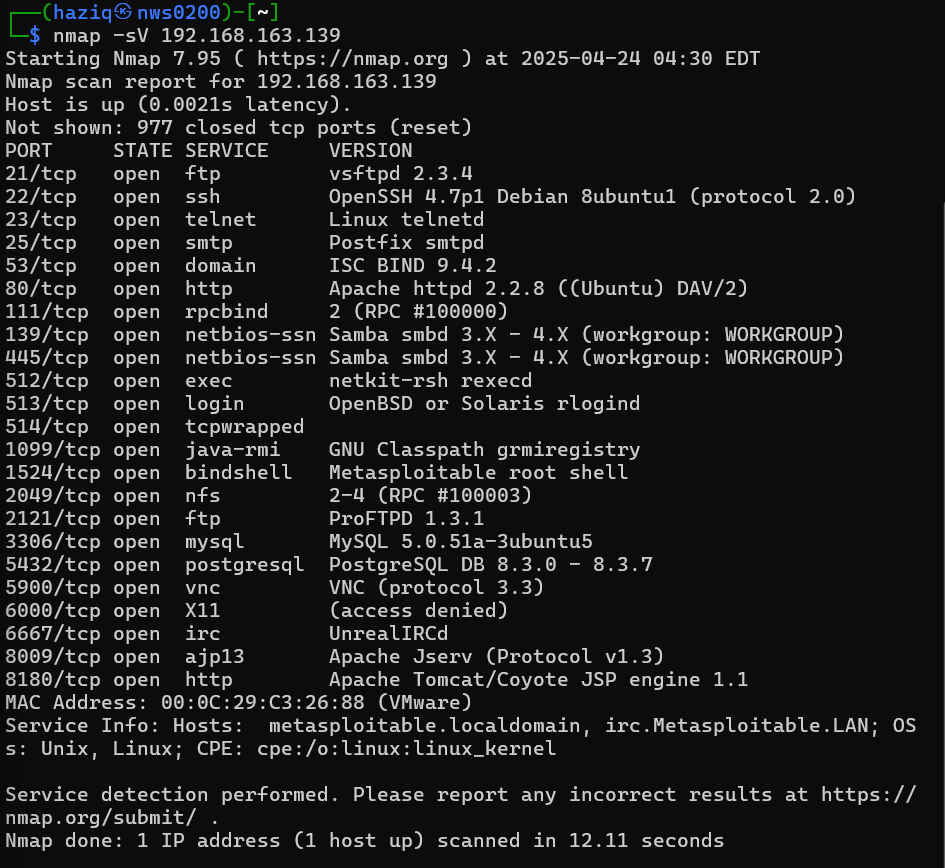

we're using this to identify the port for database which is Mysql and postgrepsql. Now lets connect to the MySQL

```sh
mysql -h <192.168.163.139> -u root 
```
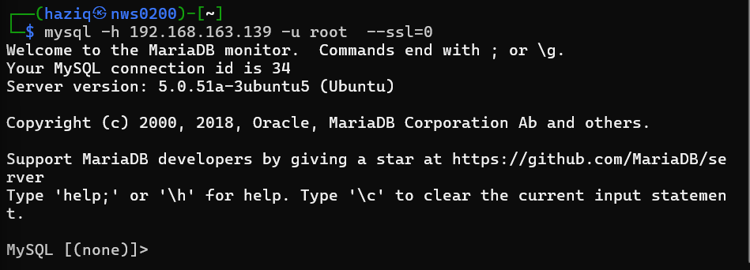

If you're met with this problem, theres a simple solution to this. And that is to skip ssl all together since mySQL does not offer/use SSL 

```sh
mysql -h <192.168.163.139> -u root --ssl=0
```


Notice that we were able to connect to mysql **WITHOUT** a password. This means that theres a cryptopgrahy failure because according to the cryptography triad

```sh
CIA
C - Confidentiality
I - Integrity
A - Authenthication 
```
Which means that by not having a password, metasploitable fails the CIA triad

### 2. Enumeration of user & Authentication Weakness

Moving on to part 2, now that we have gain access to the mySQL, we can access some stuff, starting with this command

```sh
SELECT user, host, password FROM mysql.user;
```

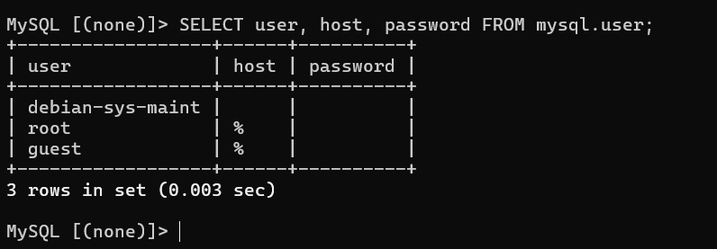

From this we can see some some major flaw like 

```sh
- All users including root has empty password (no password)
- Remote access is allowed by the modulus symbol (%) in host section
```
Is accessing a database with no password a cryptographic failure? Explain how this violates secure cryptographic authentication principles.

- Yes. As mentioned above,  authentication is a part of the CIA triad, and having no password means that this is a cryptography failure
 


### 3. Password Hash Discovery and Hash Identification

Now moving part 3, We'll first check the available databased to identify what databased contained inside using this command

```sh
SHOW DATABASES;
```

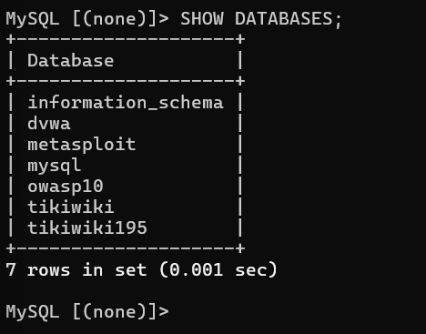

Now using the following command, we'll move into a database, we'll be using the `dvwa` databases for this part

```sh
USE dvwa
```

We've changed to the dvwa databased and now by using this command we can check the available tables in this databases

```sh
SHOW TABLES;
```

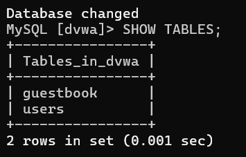

After getting the tables in the databases, we can use the following command to view the content of the tables. Specifically we wanna check the password which is kept in the form of a hash

```sh
SELECT * FROM users LIMIT 3;
```

>self note, you can also do `describe` and also do the same thing

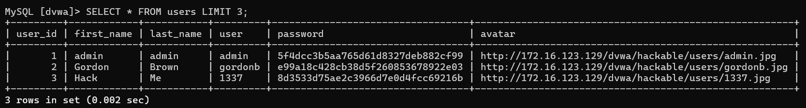

We've have now successfully got the hashes, we'll proceed with identifying the hashes. But first we'll create a file and put the hashes inside of it first using the command 

```sh
vim hashes.txt
```
and pasting the hashes we found in it 

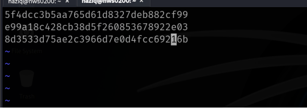

Now we can go ahead and activate hash-identifier by typing `hash-identifier` and putting in any of the hashes we found

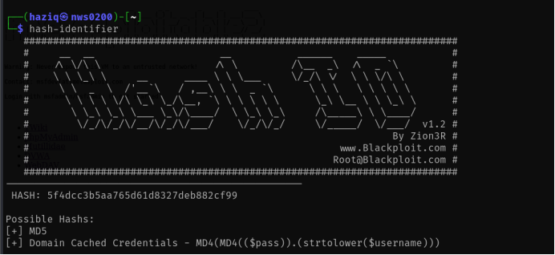

from this we can see that this hashes is potentially an MD5, we can also try to figure this out purely from using some frequency analysis purely from our information of what does a hash look like

| Hash Type | Size | Character Set          | Example                            |     |
| --------- | ---- | ---------------------- | ---------------------------------- | --- |
| MD5       | 32   | Hexadecimal (0-9, a-f) | `5f4dcc3b5aa765d61d8327deb882cf99` |     |

### 4. Hash Cracking

In this section, we'll be performing the cracking of hashes that we've obtain in part 3, we'll be using john the ripper. Now using this command to crack the hashes

```sh
john --format=raw-md5 --wordlist=/usr/share/wordlists/rockyou.txt hashes.txt
```
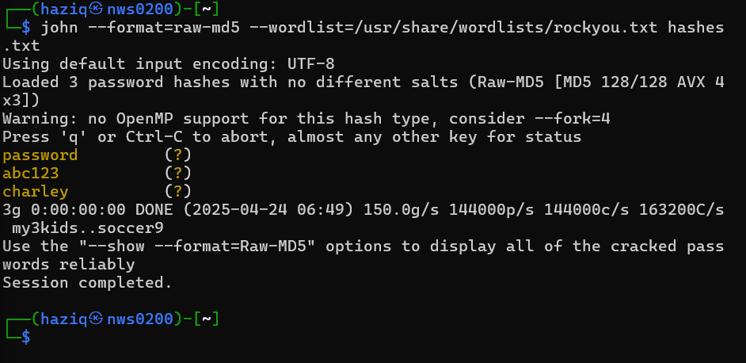

As you can see, we've crack the hashes and the cracked hash has been store in a file commonly called john.pot and we can view this file via the command 

```sh
cat ~/.john/john.pot
```
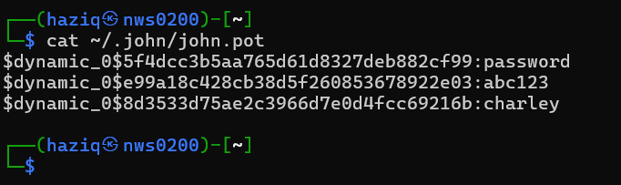

Now if for whatever reason, we wanna re-crack the same password, you might be met with this after inputting the command

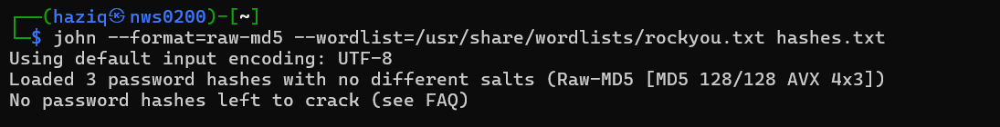

We can delete the pot by using th command

```sh
rm ~/.john/john.pot
```

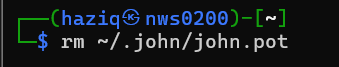

Now we should be able to crack it again by re=running the same command


### 5. Cryptographic Analysis and Mitigation

| **Issue**                 | **Explanation**                                                                                                                                              | **Mitigation / Secure Alternative**                                                                                         |
| ------------------------- | ------------------------------------------------------------------------------------------------------------------------------------------------------------ | --------------------------------------------------------------------------------------------------------------------------- |
| **Authentication Flaws**  | MySQL allowed connections from any host (`%`), which increases the attack surface and risk of unauthorized access.                                           | Restrict MySQL access by setting specific allowed hosts and enforcing account-based authentication.                         |
| **Weak Password Hashing** | Passwords are stored using **MD5 hashes**, which are fast and easily cracked using tools like John the Ripper and Hashcat with common wordlists.             | Use stronger, slow hashing algorithms like **bcrypt**, **scrypt**, or **Argon2** for password storage.                      |
| **Data Transmission**     | Connection attempts showed **TLS/SSL version mismatch**, and in some setups, SSL may not be properly configured or may fall back to plaintext communication. | Enforce **TLS 1.2 or higher**, and ensure that both server and client are correctly configured for encrypted communication. |


### Optional - Using Wireshark to check if any password/hash data is transmitted unencrypted.

Now let us try using wireshark to check if the data is being encrypted or not during transmission. First you can open wireshark by typing `sudo wireshark` in kali's terminal. Next put in this filter

```sh
http.request.method == "POST"
```

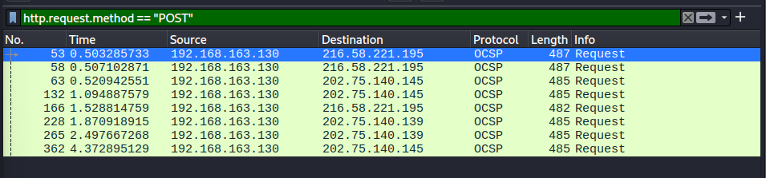

Next you wanna open DVWA website on any brower and log in into dvwa while wireshark is running

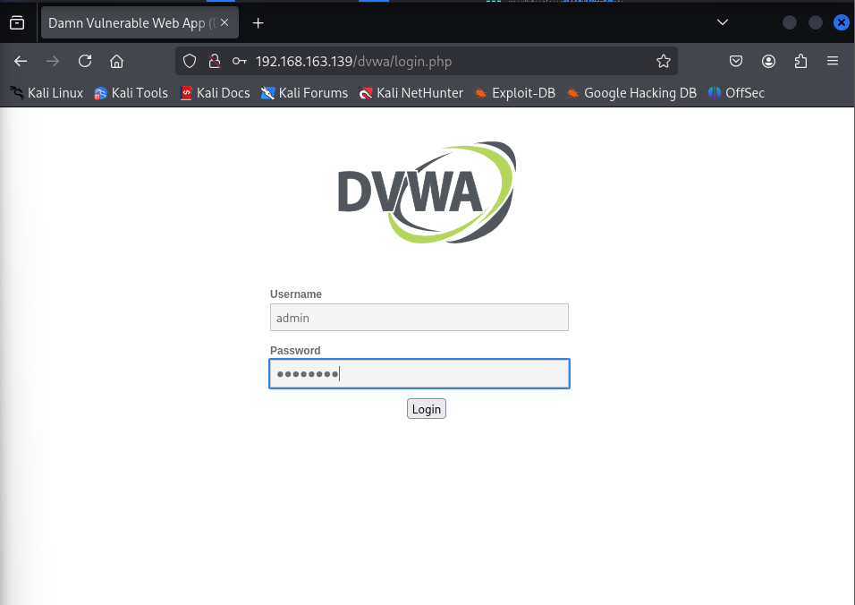

once you're in, go back to the wireshark, `right click` on any of the package that was capture, then `follow` and `TCP Stream` and we can witness that the transferred file is unecrypted

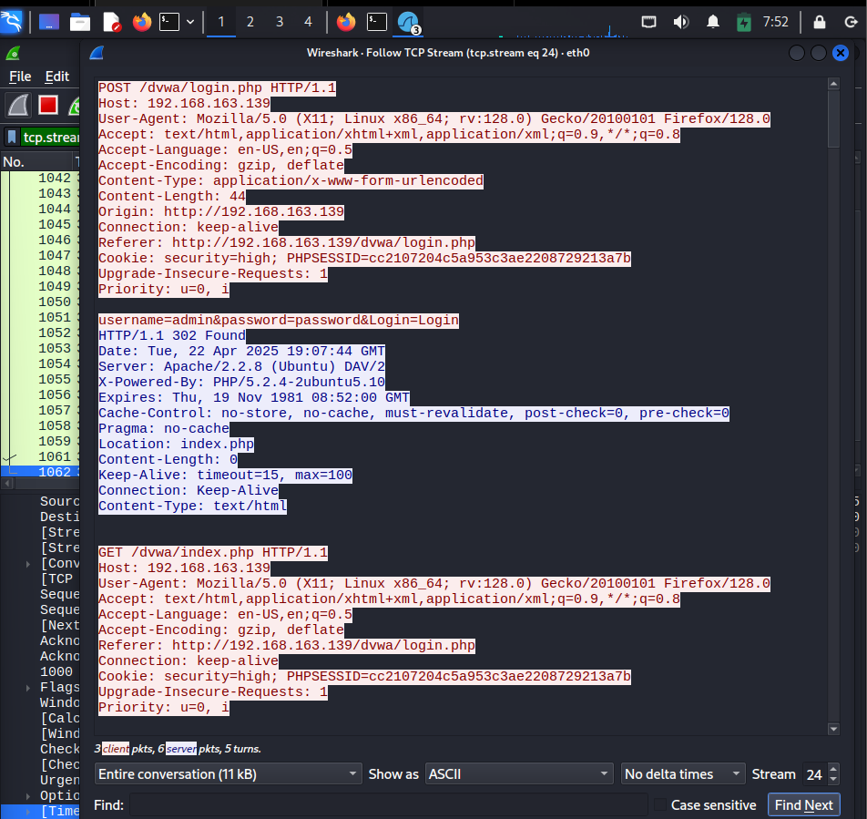