# Labwork - 3 : Hands-on Exploration of Cryptographic Tools Hashing, Encryption, and Digital Signatures

- Student: Haziq
- Tools: OpenSSL
- Platform: Kali Linux

> SELF NOTE : Don't put password together on openssl used some command with it, try looking it up, also ensure you use -base64, also using nosalt results in different stuff generated too


## Task 1: Symmetric Encryption and Decryption using AES-256-CBC

Tools used :
- OpenSSL

1. Generate a Strong Random Key and IV:

```sh
- openssl rand -hex 32 > key_haziq.bin 
- openssl rand -hex 16 > iv_haziq.bin
```
* `rand` = random generator
* `-hex 32` = make 32 hex characters = 256 bits (for AES-256)
* `> key_haziq.bin` = save to a file

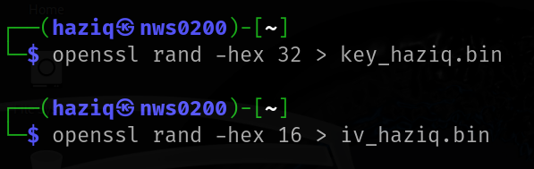

1. Create a message file:

```sh
echo "Partner, this is a top secret message from Haziq!" > haziq_message.txt
```
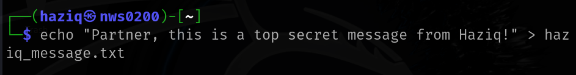

3. Encrypt using AES-256-CBC:

```sh
openssl enc -aes-256-cbc -in haziq_message.txt -out encrypted_message.bin -K $(cat key.bin) -iv $(cat iv.bin)
```
* `enc` = encrypt/decrypt tool
* `-aes-256-cbc` = encryption type (256-bit AES in CBC mode)
* `-in` = file to encrypt
* `-out` = encrypted output file
* `-K` = hex key
* `-iv` = hex IV


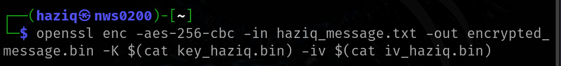

4. Zip the file to easily send it
```sh
zip task1-aes.zip encrypted_message.enc key_haziq.bin iv_haziq.bin
```
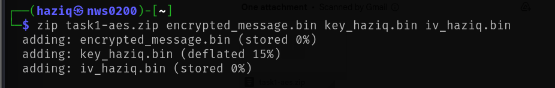

5. Send the file and key via gmail:

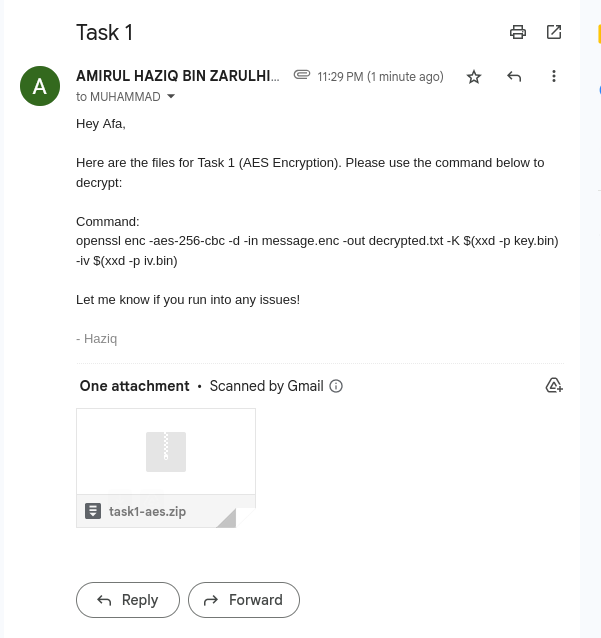

5. Decrypt the file:

```sh
openssl enc -d -aes-256-cbc -in encrypted_message.bin -out decrypted_message.txt -K $(cat key_haziq.bin) -iv $(cat iv_haziq.bin)
```


6. Compare:

```sh
diff haziq_message.txt decrypted_message.txt
```
OR
```sh
cat haziq_message.txt
cat decrypted_message.txt
```

Analysis:

- The original and decrypted files are identical.
- CBC mode requires the same key and IV. Reusing IVs can lead to leakage.

## Task 2: Asymmetric Encryption and Decryption using RSA

Tools used:
- openSSL

1. Have the partner Generate an RSA Key Pair:

```sh 
- openssl genpkey -algorithm RSA -out afa_private.pem -pkeyopt rsa_keygen_bits:2048
- openssl rsa -pubout -in afa_private.pem -out afa_public.pem
```
* `genpkey` = generate private key
* `rsa_keygen_bits:2048` = key length = 2048 bits 
* `rsa -pubout` = extract public key from the private key


1. Get the partner's public key via gmail. 

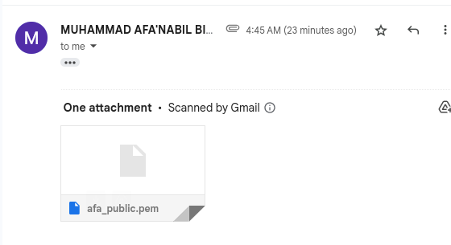

once you've downloaded the key, it'll be in download directory, so you'll have to move it to the working directory  

```sh
cd Downloads
mv afa_public.pem /home/haziq
```

3. Create Secret Message

```sh
echo "Top secret: Hello from Haziq!" > rahsia.txt
```


4. Encrypt the Message using the partner's public key

```sh
openssl pkeyutl -encrypt -inkey afa_public.pem -pubin -in rahsia.txt -out rahsia_encrypted.bin
```
* `pkeyutl` = public/private key utility
* `-encrypt` = encrypt mode
* `-inkey afa_public.pem` = use their public key
* `-pubin` = you're using a public key 
* `-in` = your secret file
* `-out` = encrypted file

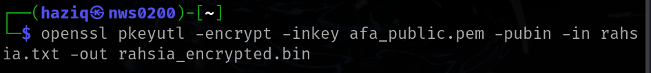

5. Partner uses their private key to Decrypt the Message 

```sh
openssl pkeyutl -decrypt -inkey afa_private.pem -in rahsia_encrypted.bin -out decrypted_rahsia.txt
```


6. Compare:

```sh
diff rahsia.txt decrypted_rahsia.txt
```
OR
```sh
cat rahsia.txt decrypted_rahsia.txt
```


Analysis:

- RSA is slow for large files; only used to encrypt small data (e.g., symmetric keys).
- 2048 bits ensures strong encryption.

## Task 3: Hashing and Integrity using SHA-256

Tools used :
- openssl dgst -sha256

1. Key generation
Generate an RSA private key

```sh
openssl genpkey -algorithm RSA -out haziq_private.pem -pkeyopt rsa_keygen_bits:2048
```
and extract a public key from it
```sh
openssl rsa -pubout -in haziq_private.pem -out haziq_public.pem
```

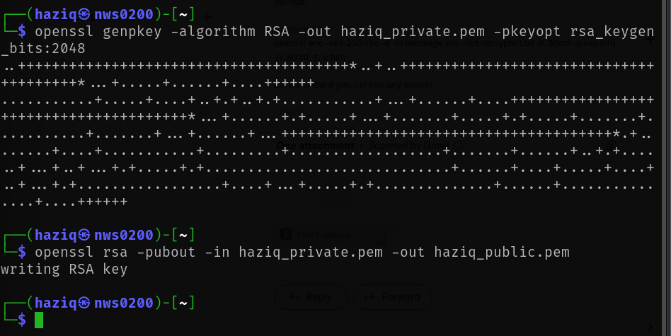

2. Create a message file:

```sh
echo "This message is digitally signed by Haziq" > message_haziq.txt
```
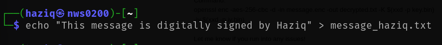

3. Generate Hash:

```sh
openssl dgst -sha256 -binary -out message_haziq.sha256 haziq_message.txt
```
* `dgst` = digest (hashing) tool
* `-sha256` = use SHA-256 algorithm
* `-binary` = output as raw binary (needed for signing)
* `-out` = save the hash


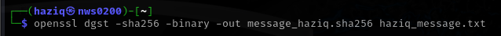

signing with private key
```sh
openssl rsautl -sign -inkey haziq_private.pem -in haziq_message.sha256 -out haziq_signature.bin
```
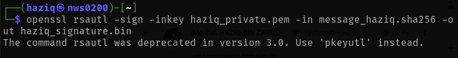

This problem occur due to the reason that the command rsautl is an old and depreciated command because of lack of modern padding support. It is also has a poor flexibility

so now we have to use this command to sign it:

```sh
openssl pkeyutl -sign -inkey haziq_private.pem -in message_haziq.sha256 -out haziq_signature.bin
```


3. Modify file:

```sh
echo "!" > haziq_message.txt
```


4. Generate hash again:

```sh
openssl dgst -sha256 -binary -out modified_message_haziq.sha256 haziq_message.txt
```


5. Compare the hashes:

```sh
diff original_hash.txt modified_hash.txt
```
or
```sh
cat message_haziq.sha256
cat modified_message_haziq.sha256
```
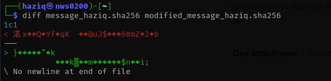

Analysis:

- Even a tiny change causes a completely different hash (avalanche effect).
- SHA-256 ensures integrity but not authenticity.


## Task 4:  Digital Signatures with RSA

Tools used: 
- OpenssL 
- Keys from Task 2


1. Create a File to Sign:

```sh
echo "This is a contract between Haziq and Afa." > agreement.txt
```
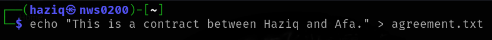

2. Create Digital Signature :

```sh
openssl dgst -sha256 -sign haziq_private.pem -out agreement.sig agreement.txt
```
* `-sign` = use private key to create a digital signature
* `agreement.sig` = this file contains the signature


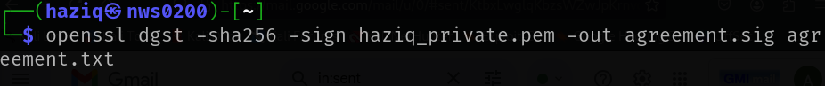

3. have the partner verify the Signature:

```sh
openssl dgst -sha256 -verify haziq_public.pem -signature agreement.sig agreement.txt
```
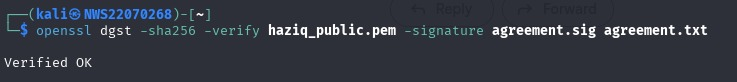


4. Simulate a Modification and Verify Again:

```sh
echo "Tampered content" >> agreement.txt
openssl dgst -sha256 -verify haziq_public.pem -signature agreement.sig agreement.txt
```
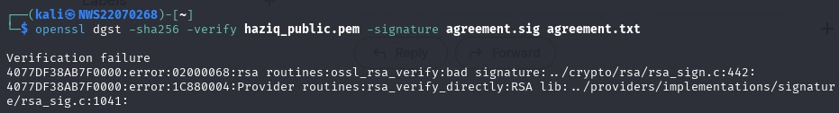

Analysis:

- Digital signatures verify both integrity and authenticity.
- Any change to the file invalidates the signature.
