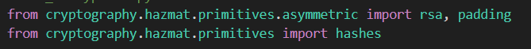

# Labwork - 4
#  Lab 4: Cryptographic Implementation in Python

---

##  Objectives

In this lab, we implemented and tested basic cryptographic operations using Python:

1. **AES** (Symmetric Encryption)
2. **RSA** (Asymmetric Encryption)
3. **SHA-256** (Hashing)
4. **RSA Digital Signatures**

Each part helps us understand how data can be protected, encrypted, and verified in real-world systems.

---
## Setup

Before we begin, we should set up the neccesary stuff first, we'll start with the library, we'll be using `Cryptography` which is a python library. For cryptography, we'll use the following command

```sh
pip install Cryptography
```


`pip` - python package installer, basically what we use to install python library
`Cryptography` - is a cryptography libraby

---

##  Task 1: Symmetric Encryption using AES

- **File:** `aes_encryption.py`
- **Library Used:** `pycryptodome`
- **Mode:** ECB (Electronic Code Book)
- **Key Size:** 128-bit (16 bytes)

###  Progression Steps:
1. A random 16-byte key is generated.
2. Message is padded to 16 bytes.
3. Message is encrypted.
4. Encrypted message is decrypted back.

### Block by block explanation:

starting from the top, we have the block

```python
from cryptography.hazmat.primitives.ciphers import Cipher, algorithms, modes
import os
```

### What it does :
* `from ... import ...`: This is like saying *"I want to use a tool from a toolbox."* You're telling Python to grab the cryptography tools (`Cipher`, `algorithms`, `modes`) from a library.
* `import os`: This gives you access to your computer’s operating system functions, like generating random bytes.


Next block is 

```python
key = os.urandom(32)
iv = os.urandom(16) 
message = b"Cryptography Lab by Haziq@NWS0200!"
```
### What it does :
* `key` is a variable that stores a secret password.
* `iv` is a random value that helps generate a different ciphertext of the same plaintext  
* `os.urandom(32)` tells Python: *"Give me 32 random bytes"* (which is 256 bits — good for strong encryption)
* `message` is the secret message you want to hide. The b before the string is a 'byte string' to tell the command that this is a string


Next, the block

```python
while len(message) % 16 != 0:
    message += b' '
```
### What it does :
* `while`: A loop that keeps going as long as a condition is true.
* `len(message) % 16 != 0` means: *"If the message length is not a multiple of 16..."*
* Then: *"Add a space (`b' '`) until it fits exactly into 16-byte chunks."*
* This line is basically adding whats called "padding"


The following block

```python
cipher = Cipher(algorithms.AES(key), modes.CBC(iv))
```
### What it does :
* We're creating a **"cipher object"** — basically, the machine that knows how to encrypt and decrypt.
* `Cipher(...)` takes two things:
  * `AES(key)`: The encryption method and secret key to use.
  * `CBC(iv)`: The mode of operation (CBC = Cipher Block Chaining) and the IV we generated.
* `cipher = ...`: This stores the encryption setup into a variable called `cipher` so we can use it later.


Next is,

```python
encryptor = cipher.encryptor()
ciphertext = encryptor.update(message) + encryptor.finalize()
```
### What it does :
* `cipher.encryptor()` creates a tool that can **encrypt messages** using the cipher setup.
* `encryptor.update(...)` processes the message.
* `encryptor.finalize()` finishes the encryption.
* The result is stored in a variable called `ciphertext`

Moving on,

```python
decryptor = cipher.decryptor()
decrypted = decryptor.update(ciphertext) + decryptor.finalize()
```
### What it does :
* Same as above — but this time, we're doing **decryption**.
* We make a `decryptor` from the same cipher setup (same key and IV).
* We decrypt the `ciphertext` to get back the original message.
* The result is saved in `decrypted`.


Last but not least,

```python
print("Original:", message)
print("Encrypted:", ciphertext.hex())
print("Decrypted:", decrypted)
```
### What it does :
* These lines show you:
  * The original message
  * The encrypted message (converted to **hex** so it looks cleaner in output)
  * The decrypted result (should match the original)


### Output
For the output here, i'll run it 3 times, 2 with the same text, to show that the generated encryption would be different due to IV and another one just as a measurement

### Same text


### different text


---

##  Task 2: Asymmetric Encryption using RSA

- **File:** `rsa_encryption.py`
- **Key Size:** 2048 bits
- **Library Used:** `Cryptography`
- **Padding:** OAEP

### Progression Steps
1. Import the required libraries (`rsa`, `padding`, `hashes`).
2. Generate RSA key pair (private and public key).
3. Create a message in bytes format.
4. Encrypt the message using the public key and OAEP padding.
5. Decrypt the ciphertext using the private key.
6. Print original, encrypted, and decrypted output.

### Block by block explanation

Fron the top, we start with

```python
from cryptography.hazmat.primitives.asymmetric import rsa, padding
from cryptography.hazmat.primitives import hashes
```

### What it does:

* `from ... import ...`: You're telling Python *"I want to use certain tools from this toolbox."*
* `rsa`: For generating RSA key pairs (public + private).
* `padding`: Required for secure encryption — it adds randomness.
* `hashes`: Needed for both padding and future signing operations.



Next block is,

```python
private_key = rsa.generate_private_key(public_exponent=65537, key_size=2048)
public_key = private_key.public_key()
```

###  What it does:

* `rsa.generate_private_key(...)`: This command creates a **private key**.
  * `public_exponent=65537`: This is a safe, standard number used in RSA. Just leave it as is.
  * `key_size=2048`: Sets the key strength. 2048 bits = strong enough for common use.
* `private_key.public_key()`: This grabs the matching **public key** from the private key.


The following line, 

```python
message = b"Hello from RSA!"
```

###  What it does:

* This is your **plaintext message** (original message) in bytes format.
* The `b` in front makes it a **byte string**, which encryption functions require.


Next is, 

```python
ciphertext = public_key.encrypt(
    message,
    padding.OAEP(
        mgf=padding.MGF1(algorithm=hashes.SHA256()),
        algorithm=hashes.SHA256(),
        label=None
    )
)
```
### What it does:

* `public_key.encrypt(...)`: This uses the **public key** to encrypt the message.
* `OAEP`: This is a **secure padding method** for RSA.

  * `MGF1` (Mask Generation Function): Adds randomness.
  * `SHA-256`: A hashing algorithm used for extra security.
  * `label=None`: Optional metadata (we don't use it here).

Follows by,

```python
plaintext = private_key.decrypt(
    ciphertext,
    padding.OAEP(
        mgf=padding.MGF1(algorithm=hashes.SHA256()),
        algorithm=hashes.SHA256(),
        label=None
    )
)
```

### What it does:

* `private_key.decrypt(...)`: Uses the **private key** to unlock and read the encrypted message.
* It uses the **same padding settings** used during encryption.


Moving on,

```python
print("Original:", message)
print("Encrypted:", ciphertext.hex())
print("Decrypted:", plaintext)
```

### What it does:

* Shows the **original**, **encrypted**, and **decrypted** results.
* `ciphertext.hex()` makes the encrypted data readable by converting it to hexadecimal format.


After this i realised that i might need to try and prove that key is both being generated, and what would happen if they key used is wrong, so the following blocks of code came to be

---

### Proof that RSA Keys Are Generated

```python
from cryptography.hazmat.primitives import serialization
```

### What it does:

* This imports the `serialization` tool which lets us convert RSA keys into readable formats (like PEM).


---

```python
print("\n[Private Key]")
print(private_key.private_bytes(
    encoding=serialization.Encoding.PEM,
    format=serialization.PrivateFormat.TraditionalOpenSSL,
    encryption_algorithm=serialization.NoEncryption()
).decode())
```

### What it does:

* This converts the private key into a **PEM format string** (a readable text format).
* It specifies:

  * PEM format (standard readable key format)
  * No encryption on the private key output
* `.decode()` converts it from bytes to a string so it can be printed.


```python
print("[Public Key]")
print(public_key.public_bytes(
    encoding=serialization.Encoding.PEM,
    format=serialization.PublicFormat.SubjectPublicKeyInfo
).decode())
```

### What it does:

* Same as above, but for the **public key**.


---

### Simulate Decryption with a Wrong Private Key

```python
wrong_private_key = rsa.generate_private_key(public_exponent=65537, key_size=2048)
```

### What it does:

* This generates a **new, unrelated private key**.
* It does NOT match the public key used to encrypt the message.


---

```python
try:
    broken = wrong_private_key.decrypt(
        ciphertext,
        padding.OAEP(
            mgf=padding.MGF1(algorithm=hashes.SHA256()),
            algorithm=hashes.SHA256(),
            label=None
        )
    )
    print("Decrypted with wrong key:", broken)
```

### What it does:

* It attempts to decrypt the encrypted message (`ciphertext`) with the **wrong private key**.
* If it somehow works (it won’t), it will print the decrypted result.

---

```python
except Exception as e:
    print("❌ Decryption failed with wrong key:", str(e))
```

### What it does:

* If the wrong key fails (which it will), this catches the error and prints a message.


### Output


---

## Task 3: Hashing with SHA-256

- **File:** `hashing.py`
- **Library Used:** `hashlib`

### Progression Steps
1. Import the `hashlib` library.
2. Create two messages in byte format with slightly different content.
3. Hash both messages using SHA-256.
4. Print both hashes to compare.
5. Screenshot the output showing they are different.


```python
import hashlib
```

### What it does:

* This imports Python’s built-in **`hashlib`** library.
* `hashlib` contains many hash functions like `md5`, `sha1`, and **`sha256`**.
* No need to install anything — it comes with Python.


---

```python
message1 = b"hello world"
message2 = b"hello GMI"  
```

### What it does:

* We define two different byte messages (`message1` and `message2`).
* The `b` before the string makes them **byte strings**, which are required by `hashlib`.
* Only one letter is different (`world` vs `World`) — this tests **sensitivity** of the hash function.


---

```python
hash1 = hashlib.sha256(message1).hexdigest()
```

### What it does: 

* `hashlib.sha256(...)`: This creates a SHA-256 hash object for `message1`.
* `.hexdigest()`: Converts the hash result into a **readable string of hex numbers**.

---

```python
hash2 = hashlib.sha256(message2).hexdigest()
```

#### What it does:

* Same as above, but for `message2`.
* This will produce a **completely different** result because SHA-256 is very sensitive — even one letter changes the hash entirely.


---

```python
print("Hash of message1:", hash1)
print("Hash of message2:", hash2)
```

### What it does:

* This prints the SHA-256 hash of both messages.
* Comparing them shows how **even small changes** in input create **completely different hashes** — which is a core security feature.


### Output:


---

##  Task 4: Digital Signatures (RSA)

- **File:** `digital_signature.py`
- **Library Used:** `Cryptography`


### Progression Steps
1. Import the required libraries (`rsa`, `padding`, `hashes`).
2. Generate RSA key pair (private and public key).
3. Create a message in byte format.
4. Sign the message using the private key with PSS padding and SHA-256.
5. Verify the signature using the public key.
6. Print whether the signature is valid or invalid.

---

```python
from cryptography.hazmat.primitives.asymmetric import rsa, padding
from cryptography.hazmat.primitives import hashes
```

###  What it does:

* Imports RSA tools for key generation and signing.
* Imports padding (needed for digital signature schemes).
* Imports hash functions like SHA-256.


---

```python
private_key = rsa.generate_private_key(public_exponent=65537, key_size=2048)
public_key = private_key.public_key()
```

### What it does:

* Creates an RSA **private key**.
* Extracts the corresponding **public key** from the private one.


---

```python
message = b"This message is signed by Haziq."
```

### What it does:

* Sets up a **byte-formatted message** that we want to sign.


---

```python
signature = private_key.sign(
    message,
    padding.PSS(
        mgf=padding.MGF1(hashes.SHA256()),
        salt_length=padding.PSS.MAX_LENGTH
    ),
    hashes.SHA256()
)
```

### What it does:

* Uses the `private_key` to **sign** the message.
* `PSS` (Probabilistic Signature Scheme) adds **random padding** for extra security.
* `SHA-256` is the hashing algorithm used before signing.


---

```python
try:
    public_key.verify(
        signature,
        message,
        padding.PSS(
            mgf=padding.MGF1(hashes.SHA256()),
            salt_length=padding.PSS.MAX_LENGTH
        ),
        hashes.SHA256()
    )
    print("✅ Signature is valid!")
except:
    print("❌ Signature is invalid.")
```

### What it does:

* Uses the **public key** to verify if the signature matches the message.
* If the message or signature was tampered with, it will raise an exception.
* If everything is valid, it prints success.


---

```python
tampered_message = b"This message is NOT signed by Haziq."

try:
    public_key.verify(
        signature,
        tampered_message,  
        padding.PSS(
            mgf=padding.MGF1(hashes.SHA256()),
            salt_length=padding.PSS.MAX_LENGTH
        ),
        hashes.SHA256()
    )
    print("❌ Tampered message verified (this should NOT happen!)")
except:
    print("🚨 Verification failed: Message has been altered!")

```
### What this does:

* This creates a **new message** that is *not* the one originally signed.
* we're using this to **simulate what happens if someone tries to change the message** after it was signed.
* This tries to **verify the tampered message** using the same signature.
* `public_key.verify(...)` will only succeed if:
  * The signature came from the correct **private key**
  * The **exact same message** was signed
* Since we changed the message, this should **fail**.
* If somehow verification passes (which it shouldn’t), this line prints an error warning.
* The block `except: print("🚨 Verification failed: Message has been altered!")` **catches the failure** from `verify()`.
* Since the message doesn’t match the signature, verification **throws an error**, and this prints a clear warning.


### output


---
##  Real-World Applications

| Algorithm        | Real-World Use                                     |
|------------------|----------------------------------------------------|
| AES              | Used in VPNs, disk encryption (e.g. BitLocker)     |
| RSA              | HTTPS/TLS encryption for websites                   |
| SHA-256          | Data integrity (e.g. file checksums, blockchain)   |
| RSA Signatures   | Secure software updates, document verification     |

---

