# Practical Test 2 : Malware analysis


## Task 1 : Static analysis and Reverse Engineering

### Step 1 :  Downloading the malware
It is important to note here that we should never download any exe file on our Host VM, and should prepare a separate sandbox or playground enviroment that we use to install any kind of suspicious executable file.

### Step 2 : Downloding The EXE

On your sandbox/playground that you set up, get the file that you want to do an analysis on, in my case, the file is on google classroom and was given by my lecturer


### Step 3 : Setting up an enviroment within our vm 

now we'll go into our vm, boot up powershell with adminstrator privilegde 

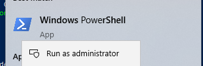

We're gonna need to set up an `venv` using python 3.8. we'll run the follwoing command 

```powershell
py -3.8 -m venv contoh
```

here we're telling pythong to create a venv or virtual enviroment using the python 3.8, we're doing this so that anything we do inside this enviroment would not be disturb or disturb any other existing enviroment in our vm. We're also naming it contoh and we 


next we'll try to execute the venv but we'll be met with this problem

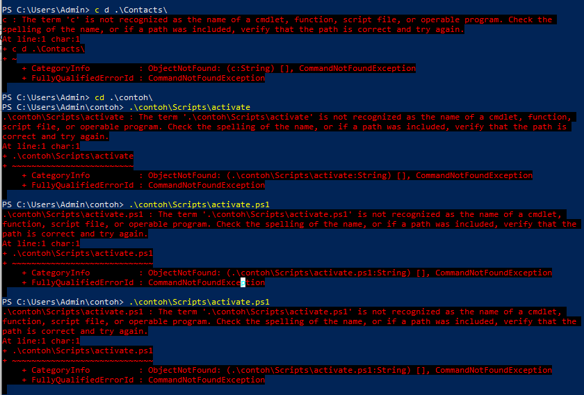
```powershell
 Set-ExecutionPolicy -Scope Process -ExecutionPolicy Bypass
 .\practical_test\Scripts\activate
```
This warning happen ebcause even runniong with administrator privilegde, powershell prevent us from running malicious code without our consent. Using the command we bypass the warning given in the screenshot above

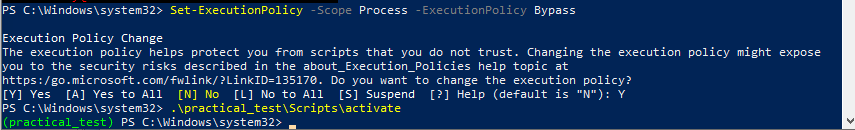

Now we've set up our enviroment to do our analysis

### Step 4 : Verify the file hash

Now we should verify that the file is indeed the same file that was intended by my lecturer. One of doing that is by using hash, so go into a powershell enviroment that we have created, to make it easier, we'll move/copy the file into the enviroment 

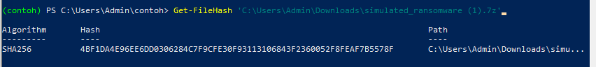
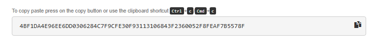

### Step 5 : Extract the file

We can now extract the file after we verify that its the same file.using 7zip 

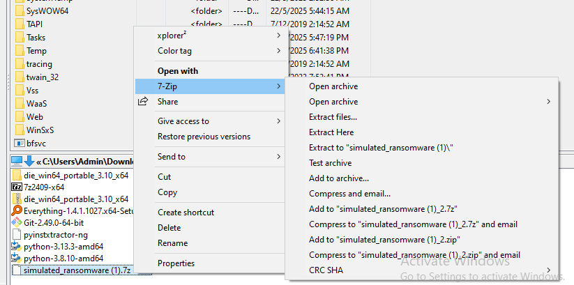

After we do that, we can use `pyinstxtractor-ng.exe` that we installed to get the content of the file. We're using this program because we know from using application `DIE` that the file was compile using python language

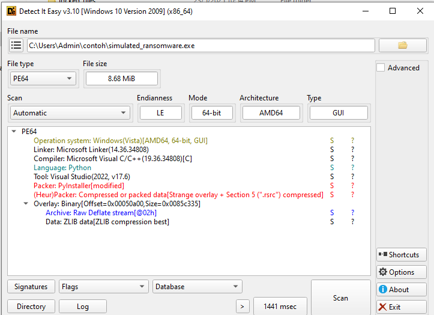
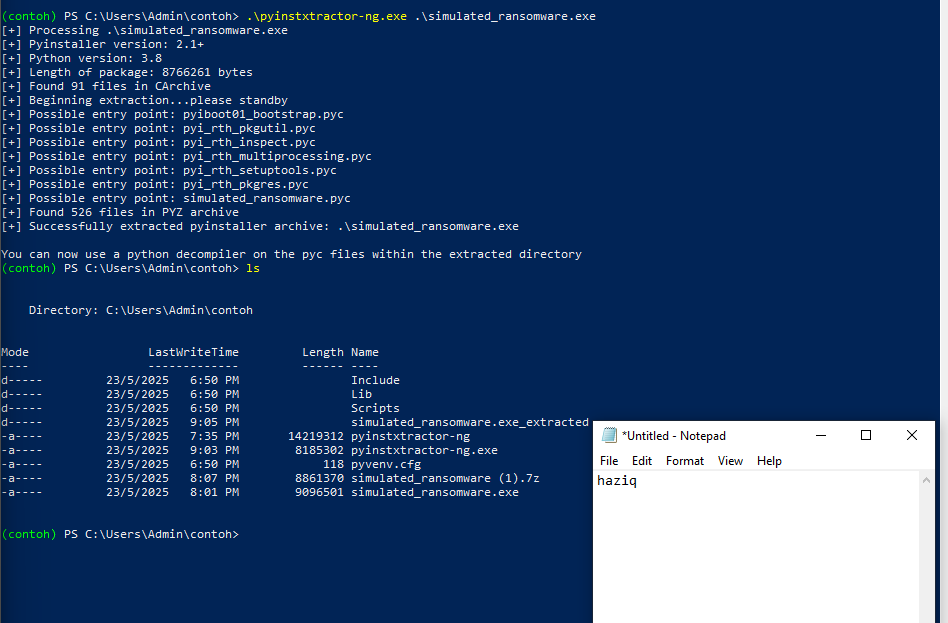

Here are the content of the file 

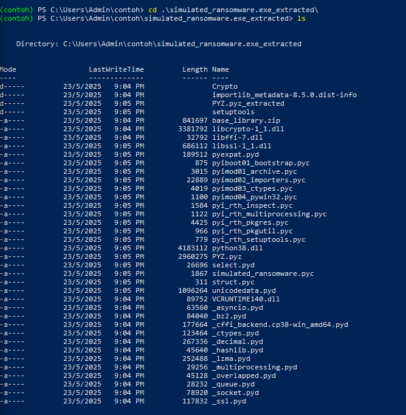

### Step 6 : Change pyc file to py

From all the file we got just now, we need to find a pyc file which then we can turn to `py` to get the code , run the following command to display only the pyc files

```powershell
ls *.pyc
```

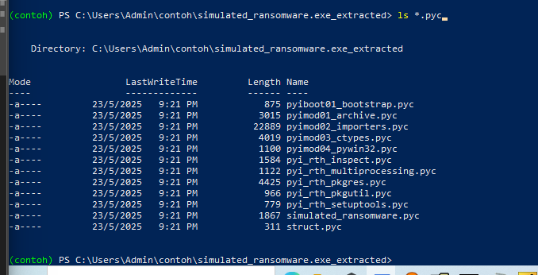

from a simple checking, we can say that the the file called `simulated_ransomware` has the highest chance to be the file with the original code. using `uncompyle6`, run the command

```powershell
uncompyle6 -o . simulated_ransomware.pyc
```

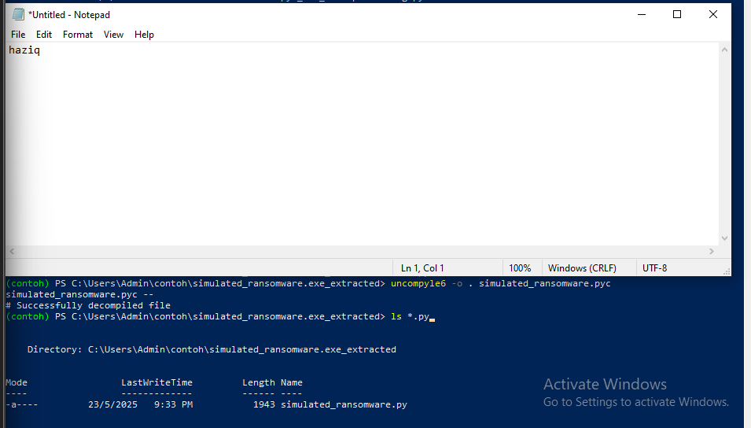

Now we can open the content and check the file in VS code. navigate to our files and click "Open using VS code" 

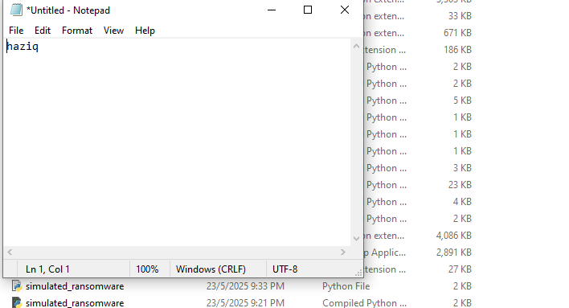

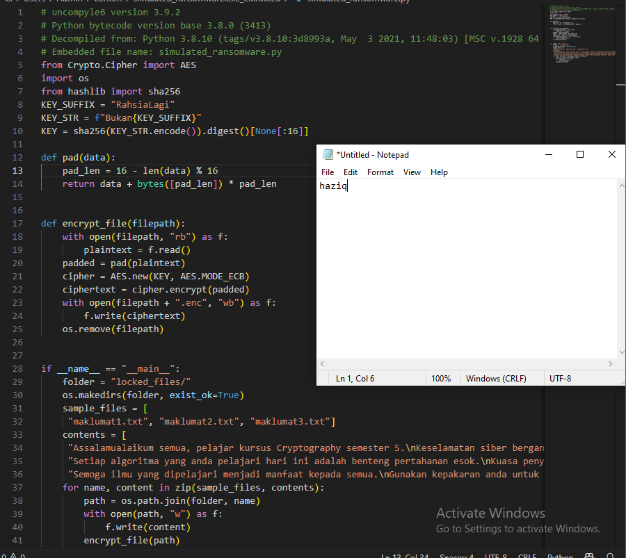

## Task 2 : Decrypting

Now that we've gotten the original python file, we'll use the content we can find from it to decrypt the files. So first we'll go back and run the `simulated_ransomware.exe` file. After we do, a new file will appear

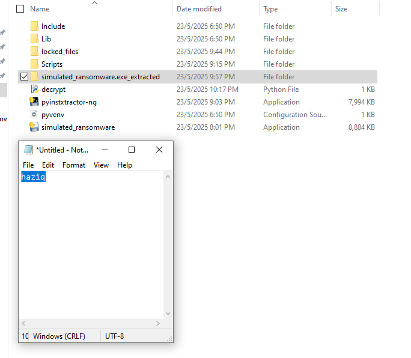

and insides are 3 files called `maklumate` and they will be unreadable (for now)

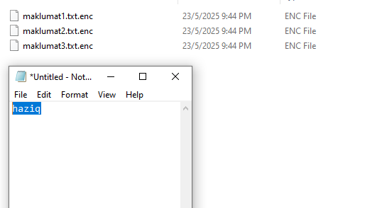

even if we go into powershell and we try to use the `cat` command to read the file, it will only display unreadable character

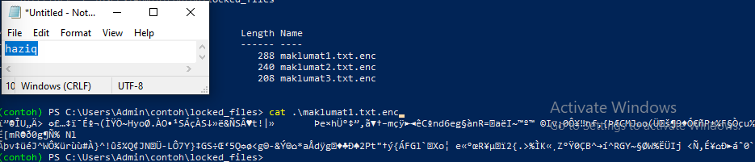

Now that we've established that the content is encrypted, lets use python to make a quick and simple decryptor base on the key and algorithm we got from the content within `simulated_ransomware.exe_extracted` 

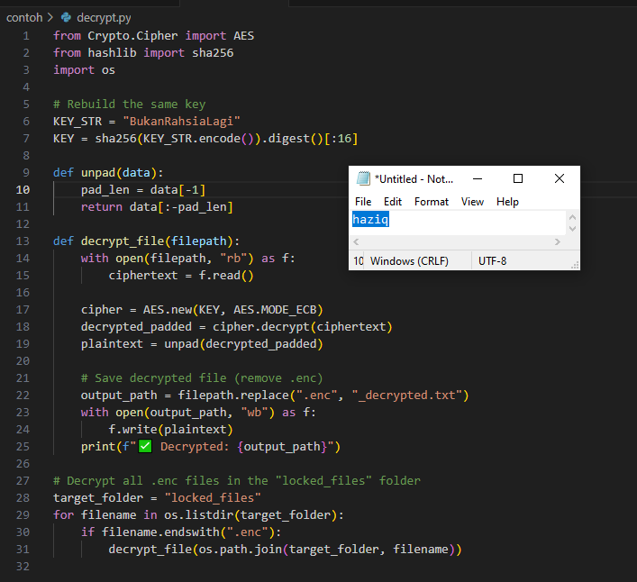

Now move the file into the same level of the `contoh` enviroment so its easier to execute

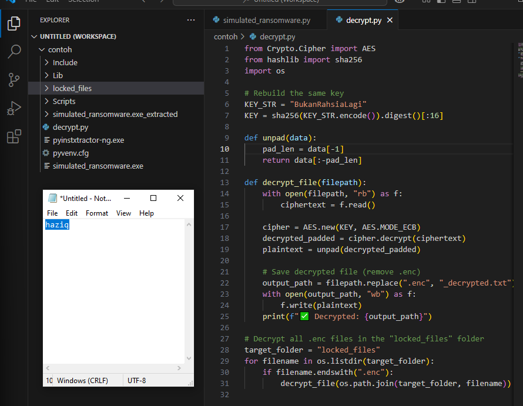

Afterwards, we can go back to the powershell and run the followeing code

```powershell
cd C:\Users\Admin\contoh
python decrypt.py
```

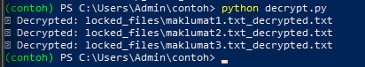

Afterwards, the locked files should be unlocked and we can view the content

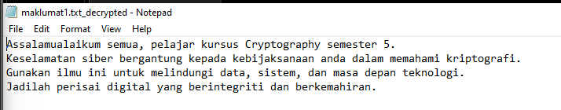
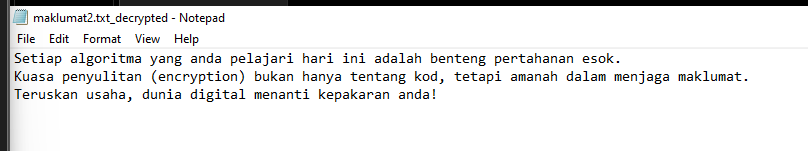
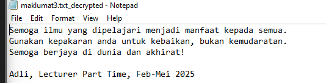


>note that the file use pycryptodome, so if you're met with the following message, you can install it using the command 

```powershell
pip install pycryptodome
```

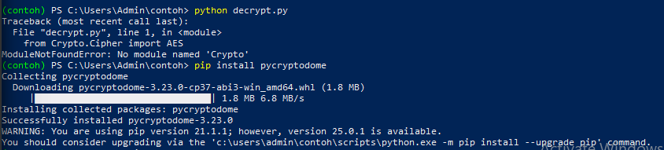