# Practical Test Report: GPG, SSH, and Hash Cracking

---

## Task 1: Generate Your GPG Key Pair

**Objective:** Use `gpg` to generate an RSA key pair tied to your identity.

### Steps:

1. Run the following command to begin key generation:

```bash
gpg --full-generate-key
```

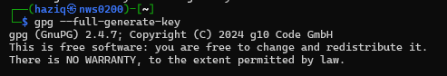

2. When prompted, enter the following details:

   * Name: Amirul Haziq
   * Email: amirulhaziq@gmail.com
   * Key Type: RSA and RSA
   * Key Size: 4096 bits
   * Expiry: 1 year

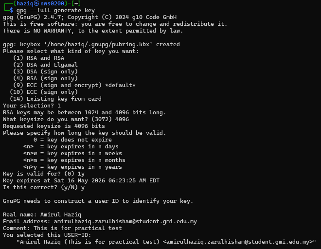

3. After completing the prompts, list your keys to confirm:

```bash
gpg --list-keys
```

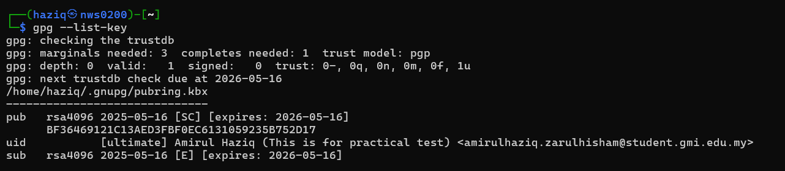

---

## Task 2: Encrypt and Decrypt a File

**Objective:** Use GPG to encrypt and then decrypt a file using your own public key.

### Steps:

1. Create a text file:

```bash
echo "This file was encrypted by Haziq (NWS23010020)" > Original.txt
```

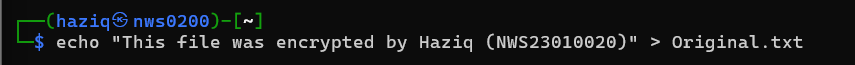

Now we can check the content of the newly created file by using cat command 

```bash
cat Original.txt
```

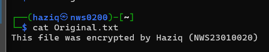

2. Encrypt the file:

```bash
gpg -e -r "Amirul Haziq" message.txt
```

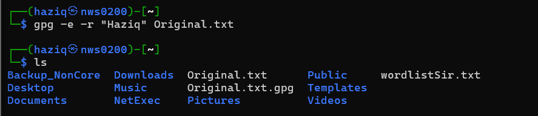

now we can see that the file `Original.txt.gpg` has been created,  you can further confirm the file has been encrypted by going into the file and checking it via the command

```bash
cat Original.txt.gpg
```

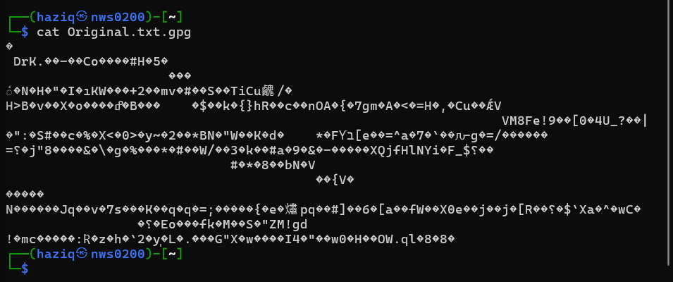

3. Decrypt the file:

```bash
gpg -d Original.txt.gpg > decrypted.txt
cat decrypted.txt
```

if you are ask for the passphrase, you can put the passphrase that you set up or receievd

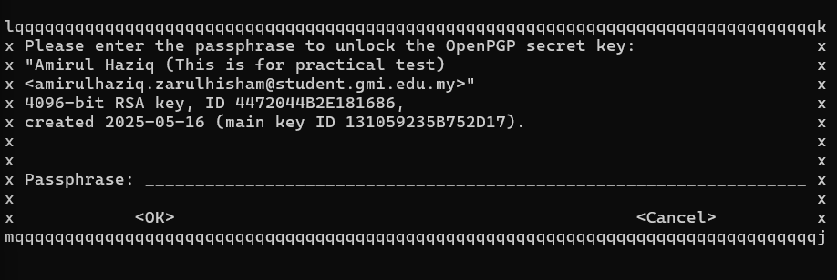

once you've put your passphrase, you can see the original message

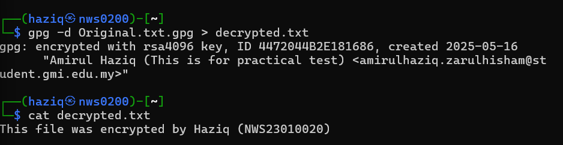

---

## Task 3: Sign and Verify a Message

**Objective:** Sign a message using your GPG key and verify the signature.

### Steps:

1. Create the message file:

```bash
vim  signed_message.txt
```
and put anything inside that can testify that this is your work and then we can use the cat command to check the content

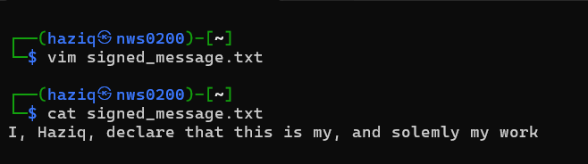

result from cat : I, Haziq, declare that this is my, and solemly my work

2. Sign the file:

```bash
gpg --clearsign signed_message.txt
```
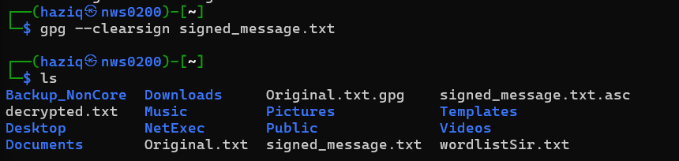

This will create a file called `signed_message.txt.asc`.

3. Verify the signature:

```bash
gpg --verify signed_message.txt.asc
```

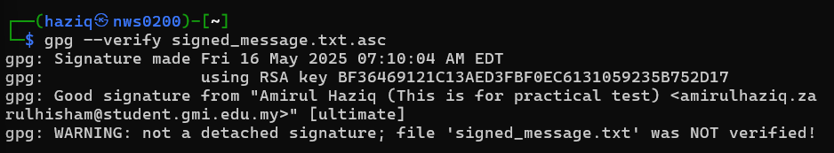

But what would happen if we sign with a different signature? lets test that scenario. First we'll generate an attacker key to simulate an attacker 

```bash
gpg --quick-generate-key "Attacker <attacker@gmail.com>" default default 1y
```

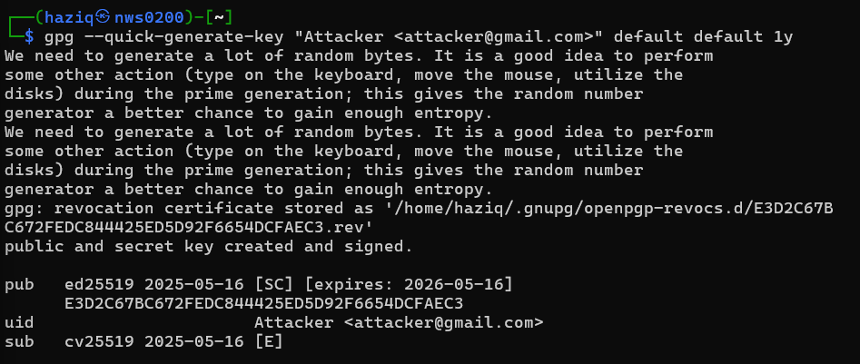

Now we'll sign the message with both our and attacker key respectively, we'll also rename the file so we can distinguish which file is signed by whom

signed by us:


signed by attacker: 

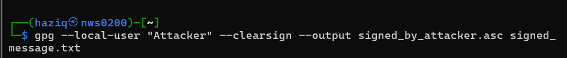

Now if we try to verify :

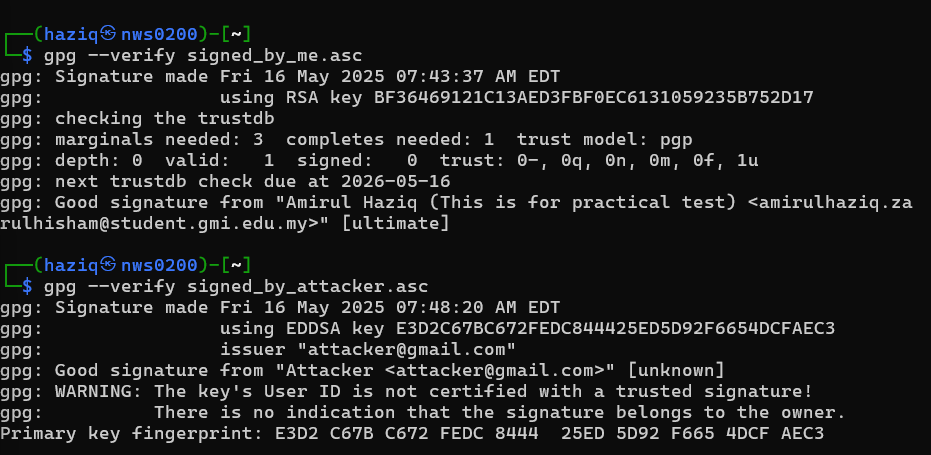

Notice that even with good signature, gpg is returning that the key is not from a trusted source

---

## Task 4: Configure Passwordless SSH Authentication


**Objective:**
Set up SSH key-based login from my Windows computer to my Kali Linux virtual machine, allowing access without needing to type a password.

### Steps :

### 1. Generate a New SSH Key Pair on Windows

Going into poweshell, we can run this command to generate an RSA key

```powershell
ssh-keygen -t rsa -b 4096 -C "Amirul Haziq-NWS23010020"
```

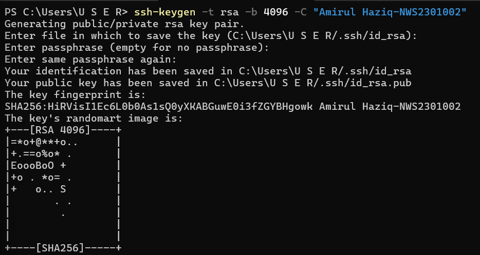

Now it should generate this files 

* `id_rsa` (private key)
* `id_rsa.pub` (public key)
  
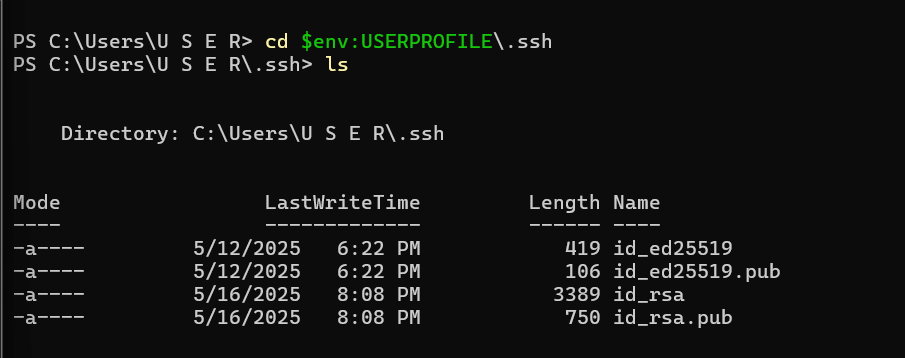

### 2. Copy the Public Key to Kali Linux

Open the key file in notepad and copy the file

```powershell
notepad $env:USERPROFILE\.ssh\id_rsa.pub
```

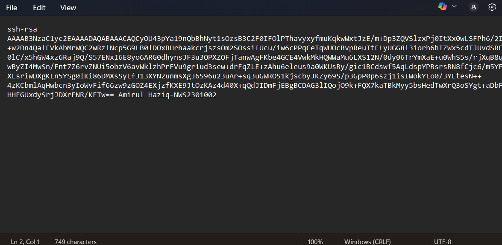

Go into a VM of our choice, in this case kali 

```powershell
ssh haziq@192.168.163.130
```

Once inside Kali, created the `.ssh` directory and added the public key:
```bash
mkdir -p ~/.ssh
vim  ~/.ssh/authorized_keys
```

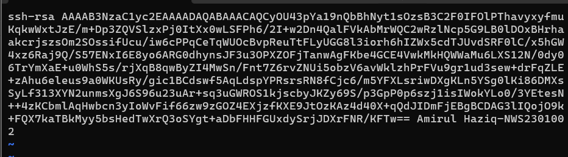

paste the public key we copied, save and change the permission

```bash
chmod 700 ~/.ssh
chmod 600 ~/.ssh/authorized_keys
```

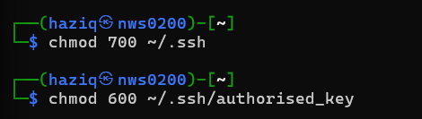

### 3. Test the Passwordless SSH Login

exit and text the keyless login

```powershell
ssh haziq@192.168.163.130
```

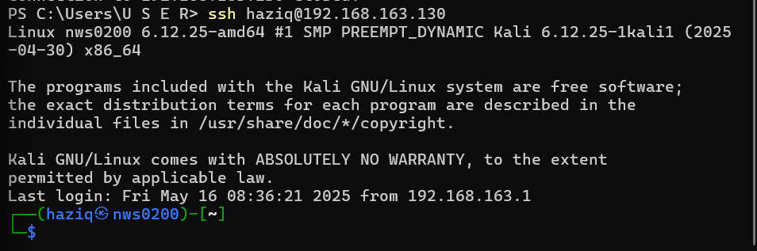

it shouldnt request for the password 

### 4. Create a File on Kali via Remote Command

Lets test this ssh by creating and checking a file from powershell into kali

```powershell
ssh haziq@192.168.163.130 "echo NWS230100020 > Amirul_Haziq.txt"
ssh haziq@192.168.163.130 cat Amirul_Haziq.txt
```

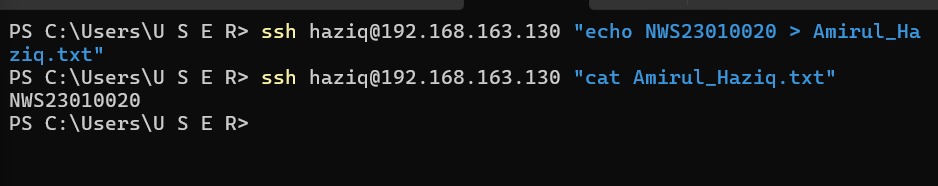

This successfully created `Amirul_Haziq.txt` in kali

### 5. Verify Remote Identity

I also ran the following to confirm the remote session user:

```powershell
ssh haziq@192.168.163.130 "whoami"
```

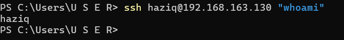

haziq was return

---

## Task 5: Hash Cracking Challenge

**Objective:**
Identify and crack the given hashes using Hash Identifier and John the Ripper with the provided wordlist.

---

### Hash List:

```
1. SnZlcmV4IEF2IEpmcmNyZSBFeiBCcnJl
2. 7b77ca1e2b3e7228a82ecbc7ca0e6b52
3. e583cee9ab9d7626c970fd6e9938fcb2d06fbbd12f1c1a3c6902a215808c825c
```

---

### Step 1: Identify Hash Types

Run the Hash Identifier tool:

```bash
hash-identifier
```

Paste each hash one by one to identify the most probable type.

**Expected Results:**

1. `SnZlcmV4IEF2IEpmcmNyZSBFeiBCcnJl` → Base64
2. `7b77ca1e2b3e7228a82ecbc7ca0e6b52` → MD5
3. `e583cee9ab9d7626c970fd6e9938fcb2d06fbbd12f1c1a3c6902a215808c825c` → SHA-256

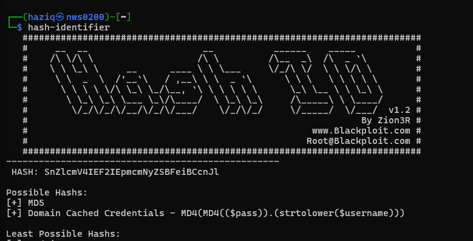
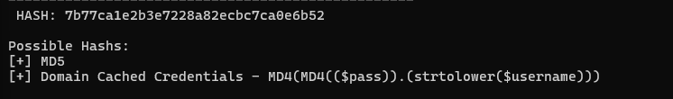
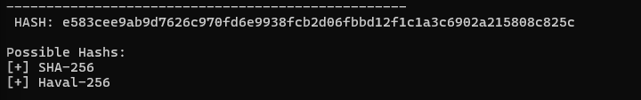
---

### Step 2: Crack Each Hash

#### Hash 1 (Base64)

We'll use an online tool for the first one called cyberchef

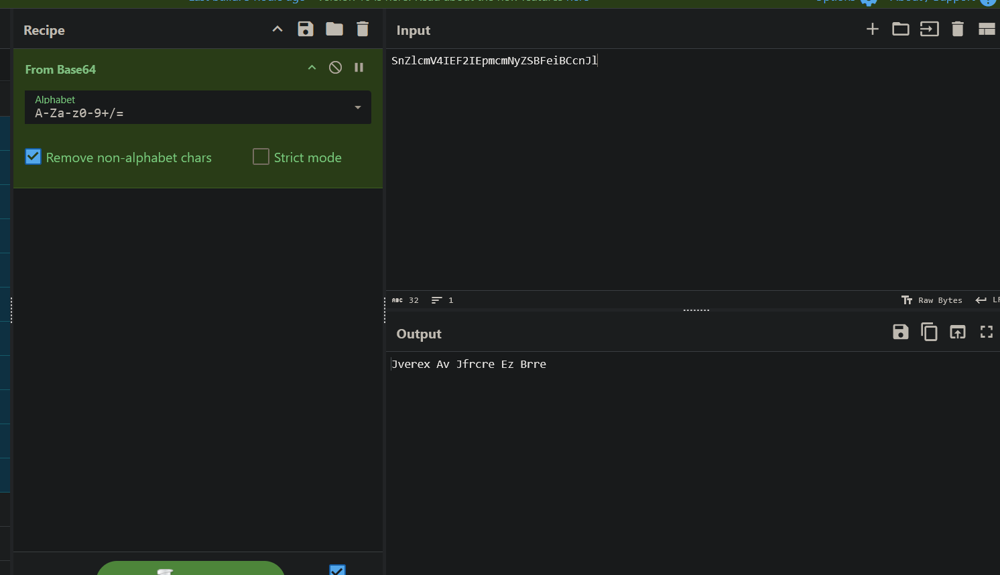

```
Jverex Av Jfrcre Ez Brre
```

using frequency analysis, we can figured out that this is a type of rot13 cipher, so we can head to a rot13 website and paste our finding

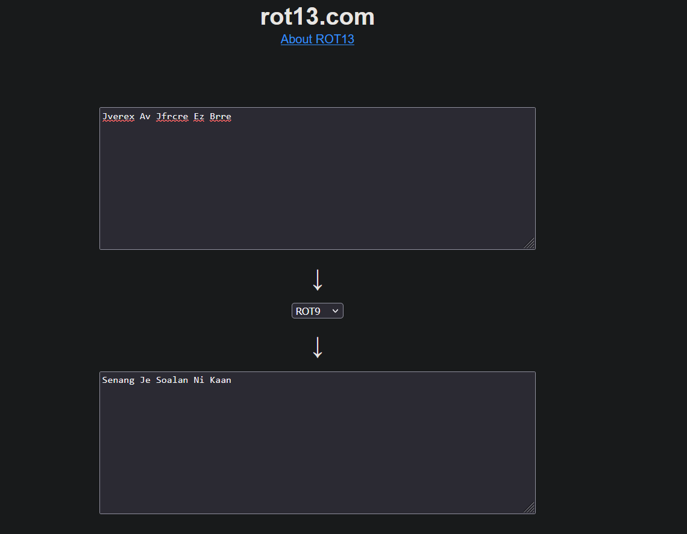

answer is : Senang Je Soalan Ni Kaan

---

#### Hash 2 (MD5)

1. Save to file:

```bash
echo "7b77ca1e2b3e7228a82ecbc7ca0e6b52" > hash2.txt
```


2. Run John:

```bash
john --format=raw-md5 --wordlist=wordlistSir.txt hash2.txt
```

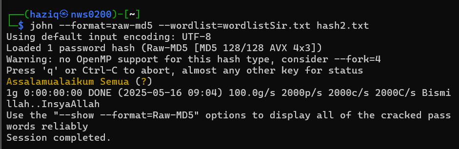

Answer is : Assalamualaikum Semua

---

#### Hash 3 (SHA-256)

1. Save to file:

```bash
echo "e583cee9ab9d7626c970fd6e9938fcb2d06fbbd12f1c1a3c6902a215808c825c" > hash3.txt
```

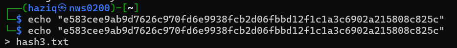

2. Run John:

```bash
john --format=raw-sha256 --wordlist=wordlistSir.txt hash3.txt
```

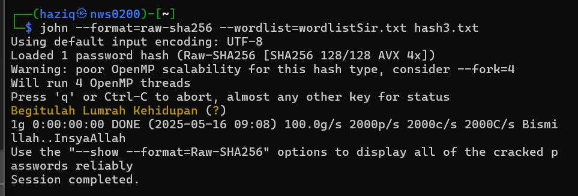
Answer is : Begitulah Lumrah Kehidupan

---


